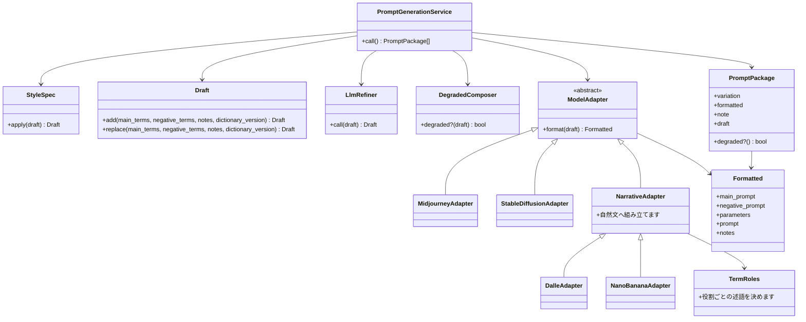
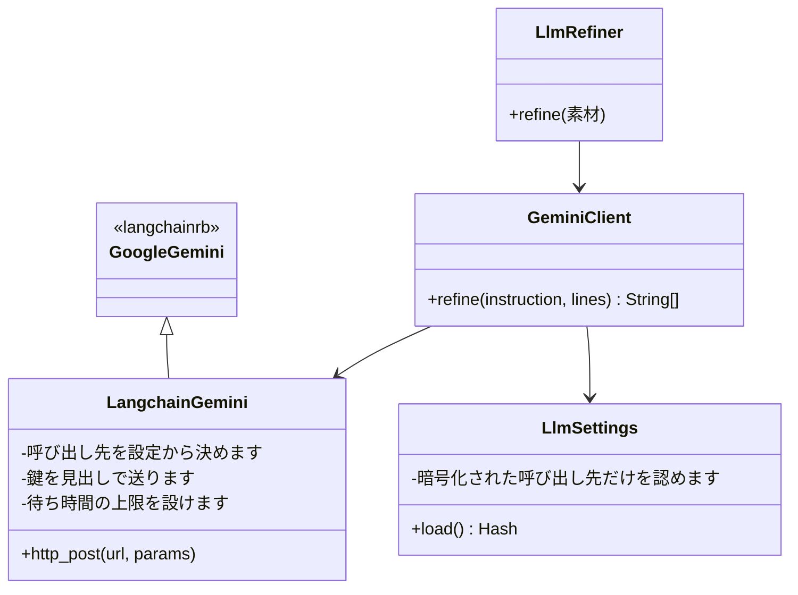
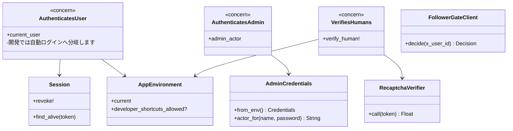
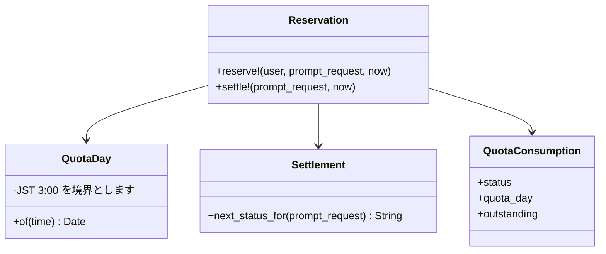
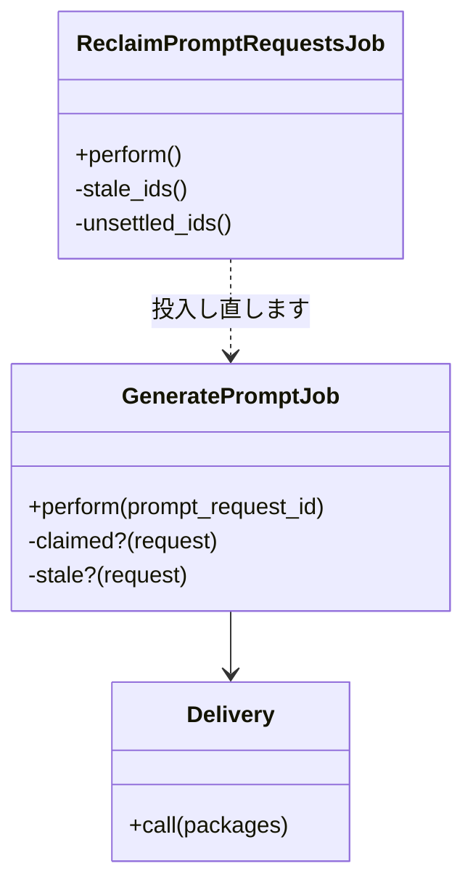

# クラス図

**実装から起こした図です。** 主要な持ち場だけを載せます。すべてのクラスを網羅しません。

## 生成の組み立て

**整えるのと、包むのは別の持ち場です。** 生成モデルごとの整形は `Formatted` を返します。**それを案の情報（何案目か・ノート・下書き）と一緒に包んだものが `PromptPackage` です。** 包むのは `PromptGenerationService` です。

**生成モデルごとの違いは、整形の持ち場に閉じます。** 語を並べるモデル（Midjourney ・ Stable Diffusion）は `ModelAdapter` を直に継ぎます。**自然文で述べるモデル（DALL·E ・ nano banana）は、`NarrativeAdapter` を間に挟みます。** 自然文の組み立て方を 2 つのモデルで分け持つためです。

**素材の役割は控えから受け取ります**（`TermRoles`）。素材の文字列を照合して見分けません。言い回しが変わったときに黙って外れるためです。

## LLM の呼び出し

**上書きするのは 3 点だけです。** 呼び出し先・鍵の送り方・待ち時間です。**そのほかは gem に委ねます。**

## 認証とアクセス制御

**環境ごとの分岐は `AppEnvironment` を必ず通します。** 環境変数を各所で直に読むと、判定の条件が散らばって追えなくなります。**未設定・未知の値は例外にします。**

**管理画面の照合と実施者の決定は、1 つの返り値にまとめます。** 通らなかった名前を実施者として控えられません。

## クォータ（1 日の生成枠）

## 生成の投入と拾い直し

**置き去りと見なすまでの時間は、両方の持ち場で同じ値です。** 書き写さず、片方から引きます。片方だけを直すと、拾い直しが黙って発火しなくなります。
