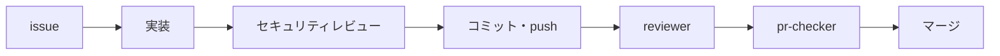

# 開発の流れ

実装した工程のみを記載します。

```mermaid
flowchart LR
    A[issue] --> B[実装]
    B --> C[セキュリティレビュー]
    C --> D[コミット・push]
    D --> E[reviewer]
    E --> F[pr-checker]
    F --> G[マージ]
```

各工程はフックで強制しています。セキュリティレビューの記録が無ければコミットが止まり、
reviewer と pr-checker の記録が無ければマージが止まります。
