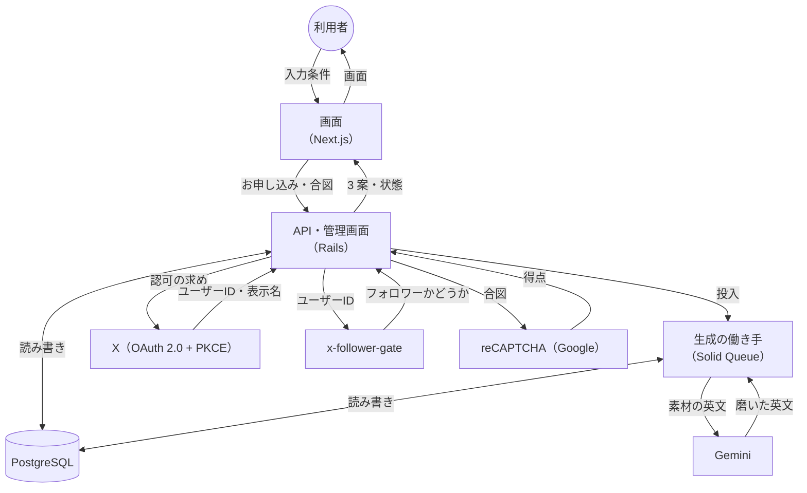
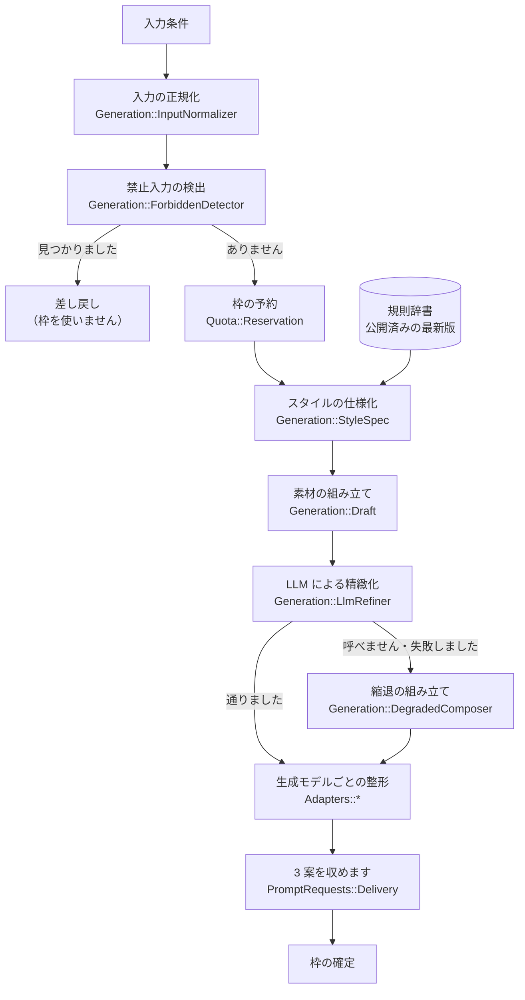

# DFD（データフロー図）

**実装から起こした図です。** 実際に流れているものだけを載せます。

## 全体

**画面はバックエンドの住所を持ちません。** 画面の中の中継（`BACKEND_INTERNAL_URL`）を通します。**ブラウザへ配りません。**

## 生成の流れ（詳細）

**禁止入力の検出は、枠の予約より先です。** 差し戻しは枠を使いません。

**LLM が使えない場合も止まりません。** 規則辞書だけで組み立てる縮退へ回ります（`requirements.md` 5.1）。**縮退で作った案には、その旨を明記します。**

## 外へ出す情報

| 宛先 | 送るもの | 送らないもの |
|---|---|---|
| X | 認可の求め（PKCE） | 生成の内容 |
| x-follower-gate | X のユーザー ID | 表示名・生成の内容 |
| reCAPTCHA（Google） | 秘密鍵・画面が受け取った合図 | **要求元のアドレス**・利用者の識別子・生成の内容 |
| Gemini | 指示文・磨く対象の英文 | 認証情報・利用者の識別子・セッション |

**LLM へ送るのは、利用者の入力条件から組み立てた素材だけです**（`requirements.md` 5.2）。

## 記録に残すもの

| 表 | 残すもの | 残さないもの |
|---|---|---|
| `metric_events` | 測定軸ごとの日別の件数 | **誰の分かを残しません** |
| `admin_actions` | 実施者・操作・対象・日時 | **合言葉を残しません** |
| `sessions` | 識別子のハッシュ・失効時刻 | **識別子そのものを残しません** |
