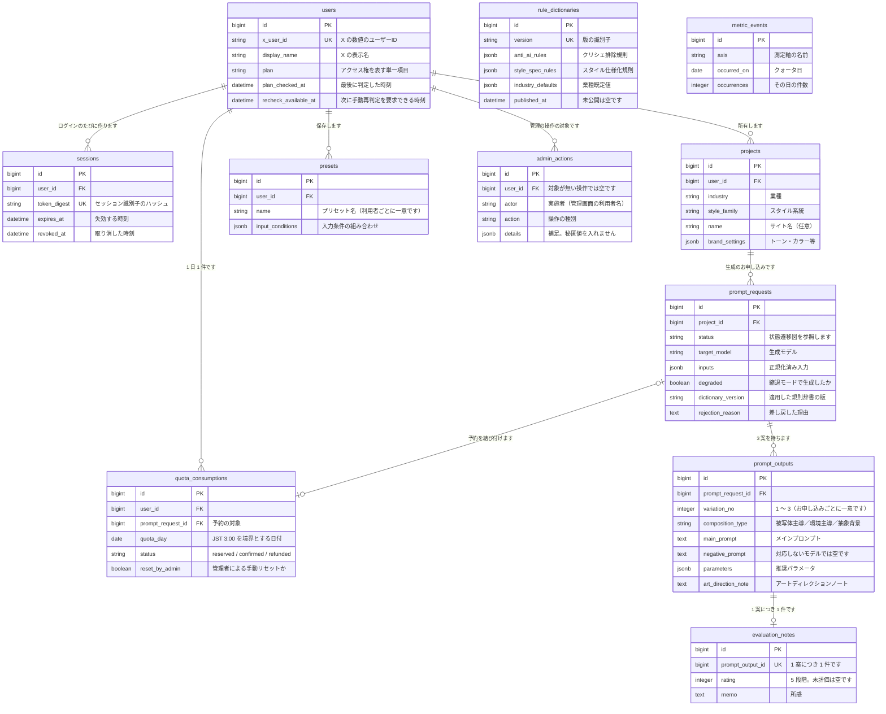

# ER 図

**実装から起こした図です。** 正は `src/backend/db/schema.rb` です。

**待ち行列とキャッシュの表（`solid_queue_*` ・ `solid_cache_entries`）は載せません。** Rails の仕組みが持つ表で、業務の意味を持たないためです。

## 読み取りの要点

**`rule_dictionaries` と `metric_events` は、どの表とも外部キーで結び付きません。**

- `rule_dictionaries` は版として積み上げます。**公開済みの版を書き換えません。** どの版を使ったかは `prompt_requests.dictionary_version` が文字列で持ちます。**外部キーにしません。** 版が消えても、当時どの版で作ったかの記録は残す必要があるためです。
- `metric_events` は日ごとの件数だけを持ちます。**誰の分かを持ちません**（`requirements.md` 7.1）。

**`quota_consumptions` は、利用者とクォータ日の組で一意です。** 同じ日に 2 件作れません。**予約中（`reserved`）の行は、1 つのお申し込みにつき 1 件だけ**という部分一意の索引も持ちます。

**`prompt_requests` と `quota_consumptions` の結び付きは、後から付きます。** 枠の予約は、お申し込みの行を作る前に行うためです（`prompt_request_id` は空を許します）。

**利用者を消す経路はありません。** 生成履歴が結び付いているためです。
