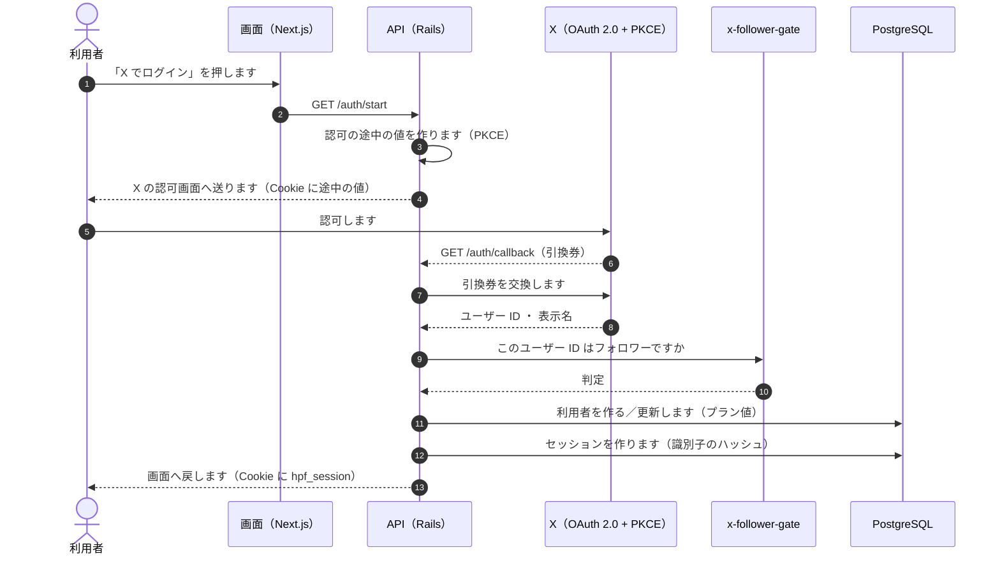
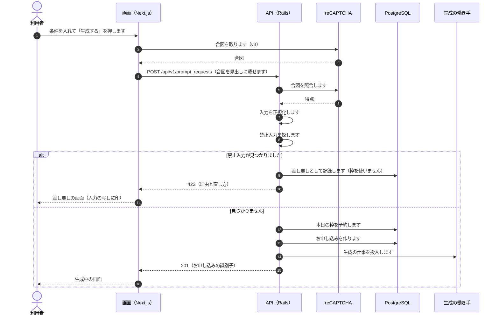
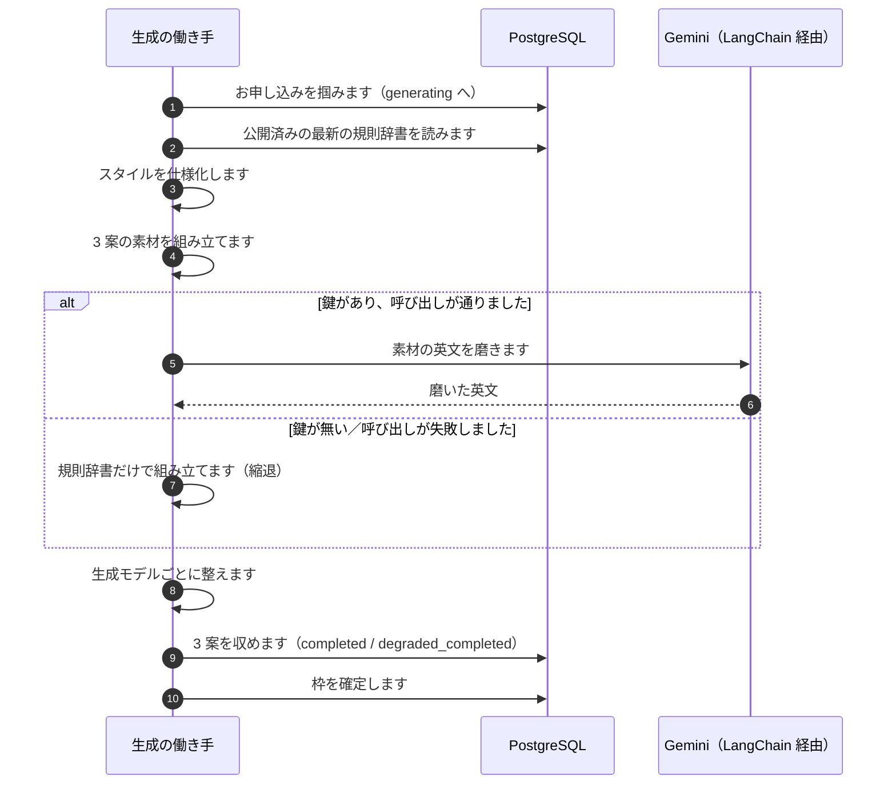
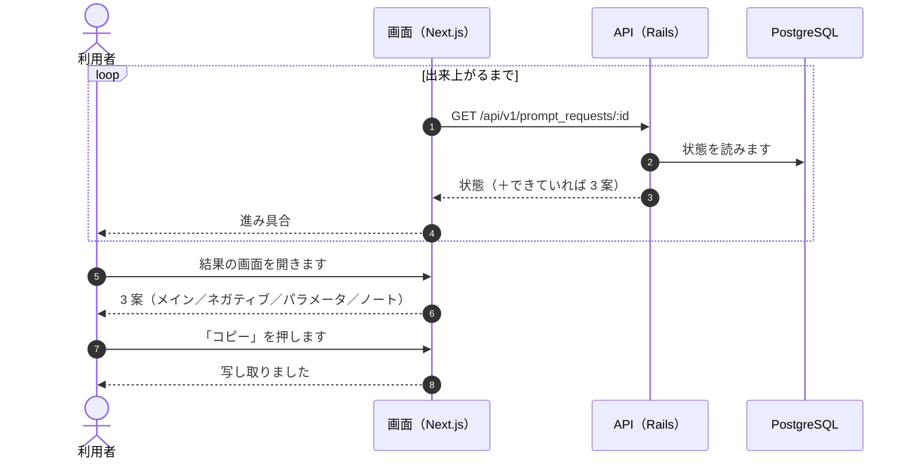
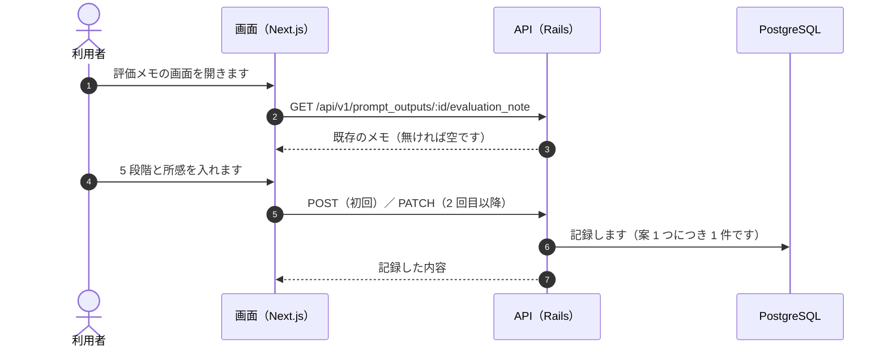
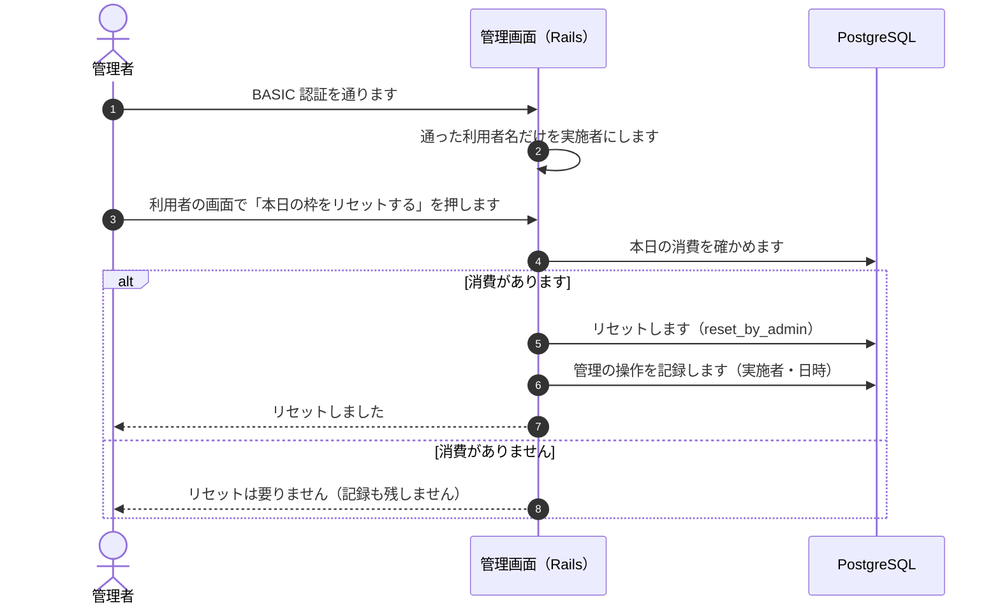

# シーケンス図

**実装から起こした図です。** 実際の経路だけを載せます。

## 1. X でログインします

**Cookie は 2 つです。** 認可の途中の値（短命）と、セッション（`hpf_session`）です。**セッションの識別子そのものは保存しません。** ハッシュだけを持ちます。

**フォロワー判定を自前で作りません**（`requirements.md` 6）。判定サービスへ問い合わせ、**結果はプラン値という 1 つの項目に落とします。**

## 2. 生成をお申し込みします

**合図の照合は、本番では必ず行います。** 開発では、秘密鍵が設定されているときだけ行います。

**枠の予約は、お申し込みの行を作る前です。** 予約できなければ、そこで止めます（上限到達）。

## 3. 3 案ができるまで

**働き手が異常終了した場合は、定時の拾い直し（5 分ごと）が拾い直します。**

## 4. 進み具合を見て、3 案を受け取ります

**縮退で作った案には、その旨を出します。**

## 5. 評価メモを残します

**上限に達していても記録できます。** 評価メモは枠を使いません。

## 6. 管理者が本日の枠をリセットします

**通らなかった資格情報の名前は、実施者として控えません。**
