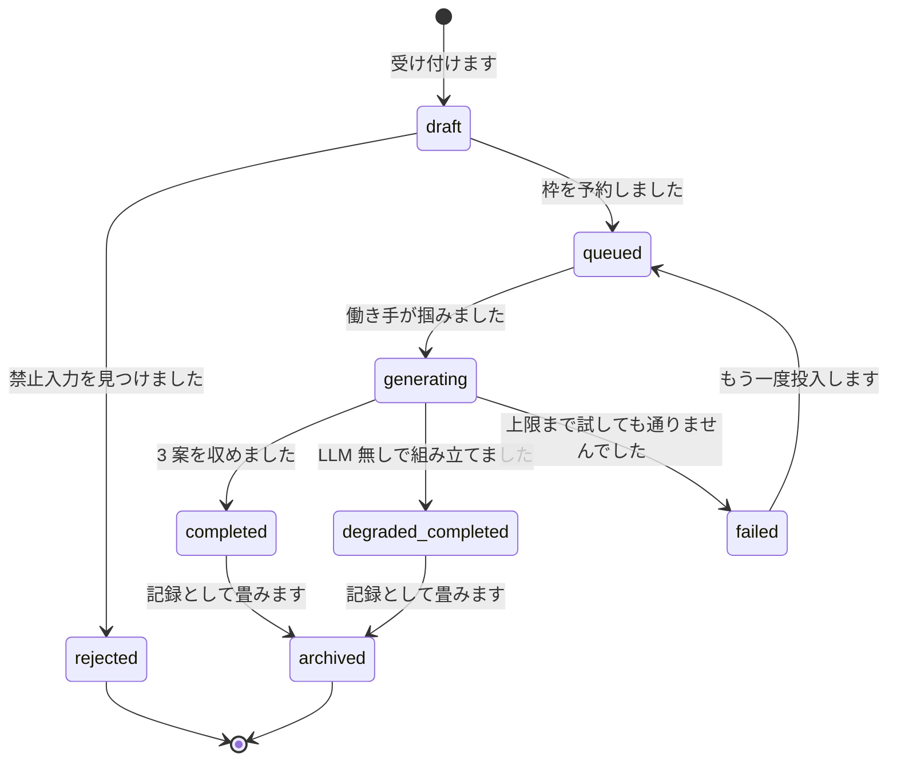
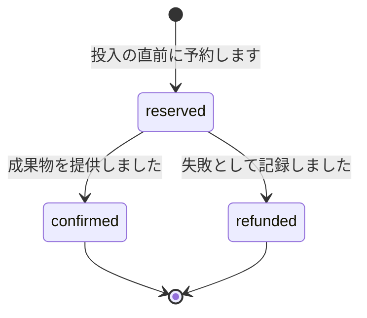
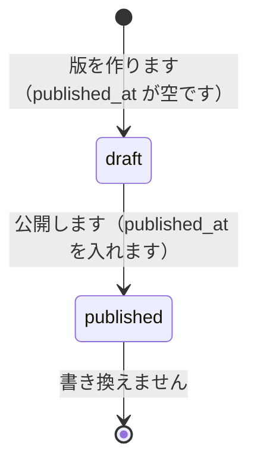
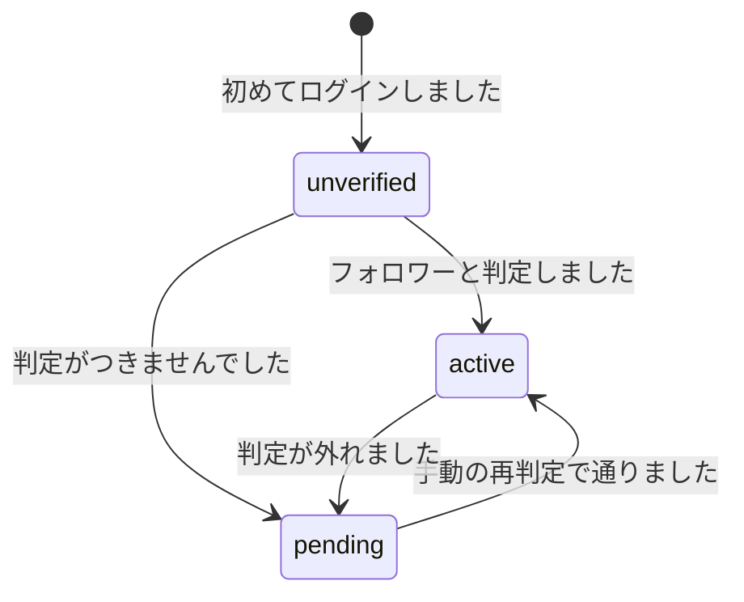

# 状態遷移図

**実装から起こした図です。** 正は `src/backend/app/models/prompt_request.rb`（`TRANSITIONS`）と `src/backend/app/services/quota/`（クォータの状態）です。

## 生成リクエストの状態

**定義されていない遷移は拒否します**（`InvalidTransitionError`）。状態を直に書き換えず、必ず遷移の手続きを通します。

| 状態 | 意味 | 枠の扱い |
|---|---|---|
| `draft` | 受け付けた直後です | まだ予約しません |
| `rejected` | 禁止入力を見つけ、差し戻しました | **予約しません。** 枠を使いません |
| `queued` | 待ち行列へ入れました | **予約します**（`reserved`） |
| `generating` | 組み立てています | 予約のままです |
| `completed` | 3 案を収めました | **確定します**（`confirmed`） |
| `degraded_completed` | LLM 無しで組み立てました | **確定します**（`confirmed`） |
| `failed` | 上限まで試しても通りませんでした | **返します**（`refunded`） |
| `archived` | 記録として畳みました | 変わりません |

**`rejected` は枠を使いません。** 禁止入力の判定を、枠の予約より先に置いています。

**`generating` から `failed` を経て `queued` へ戻れます。** 同じお申し込みを、もう一度組み立て直せます。

## クォータ（1 日の生成枠）の状態

**クォータ日は JST 3:00 を境界とします**（`Quota::QuotaDay`）。午前 0 時ではありません。

**予約したまま置き去りになる行があります。** 働き手が異常終了した場合です。**定時の拾い直し（`ReclaimPromptRequestsJob`、5 分ごと）が、決着だけが残った行を拾い直します。** 拾い直さないと、翌日以降の予約そのものが止まります（`DanglingReservationError`）。

**管理者は手動でリセットできます**（`reset_by_admin`）。記録は `admin_actions` に残ります。

## 規則辞書の状態

**公開済みの版は書き換えません。** 内容を変える場合は、新しい版を作って公開します。**生成は、公開済みの最新の版を使います。**

## 利用者のプラン値

**機能側はプラン値だけを見ます**（`requirements.md` 6）。フォロー判定の有無から直に分岐しません。**判定手段を変えても、機能側の実装に影響しません。**

**手動の再判定には待ち時間を設けます**（`recheck_available_at`）。続けて実行できません。
