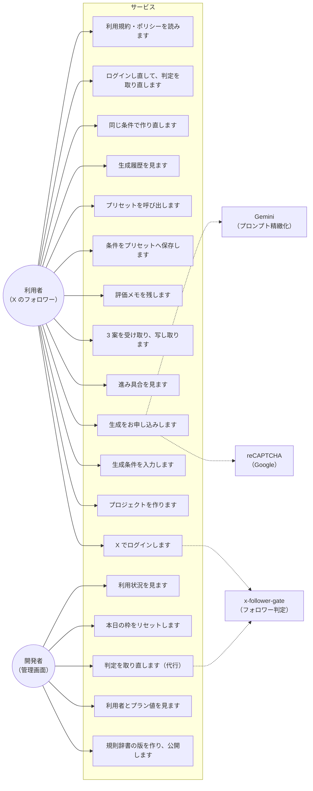

# ユースケース図

**実装から起こした図です。** 実装済みの操作だけを載せます。

## 前提

| 操作 | 誰が行えるか |
|---|---|
| 利用規約・ポリシーを読みます | **誰でも行えます。** ログインを求めません |
| X でログインします | 誰でも試せます。**フォロワーでない方は入れません** |
| 生成のお申し込み | **プラン値が `active` の方だけ**です |
| そのほかの操作 | ログイン済みの方です |
| 管理画面のすべて | **BASIC 認証を通った開発者だけ**です。利用者の権限では届きません |

## 判定の取り直しについて

**利用者の側に、判定を取り直す押しものはありません。** UC12 は、**あらためてログインし直すこと**を指します。ログインのたびに判定を取り直しますので、フォローの直後に入れなかった方は、もう一度ログインすると入れます。

**押しもの（手動の再判定の導線）は `requirements.md` 6 が求めていますが、まだ実装していません。** 実装があるのは、管理者が代行する側（UC22）だけです。**この差は `SPEC/README.md` に書いています。**

## 実装していないもの

**この図に無い操作は、実装していません。** 例として、プロジェクトの削除・利用者の削除・案の再生成の個別指定は、経路そのものがありません。
