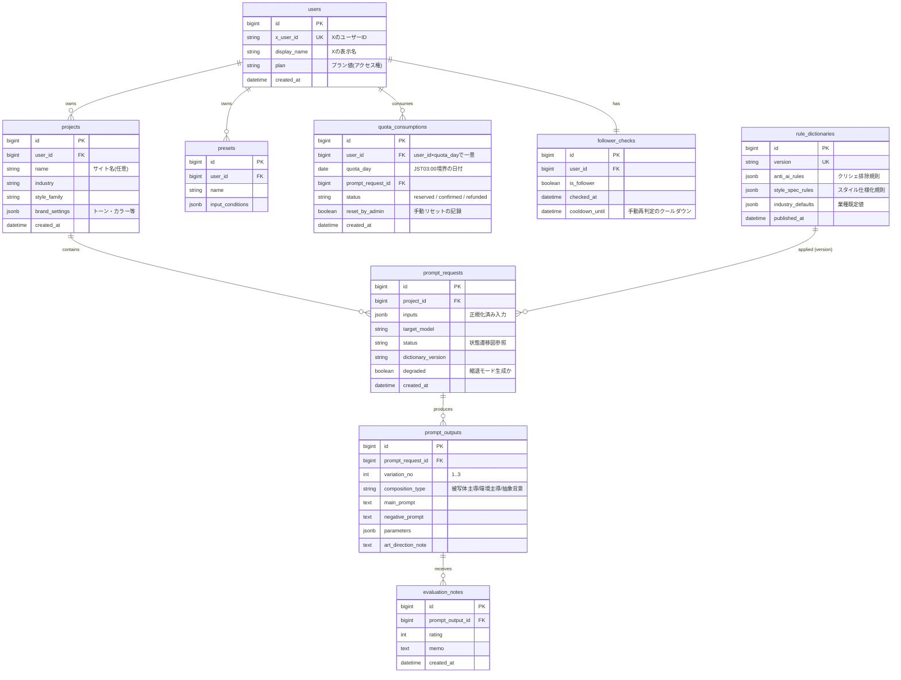
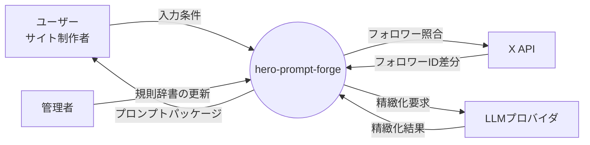
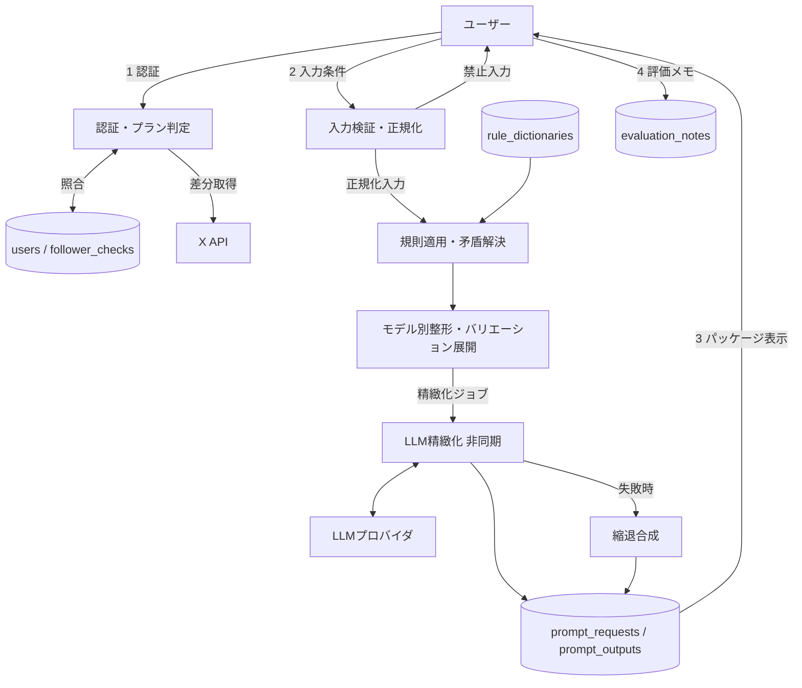
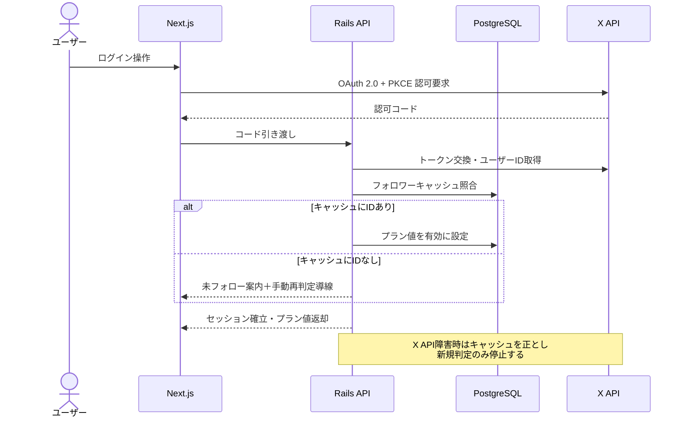
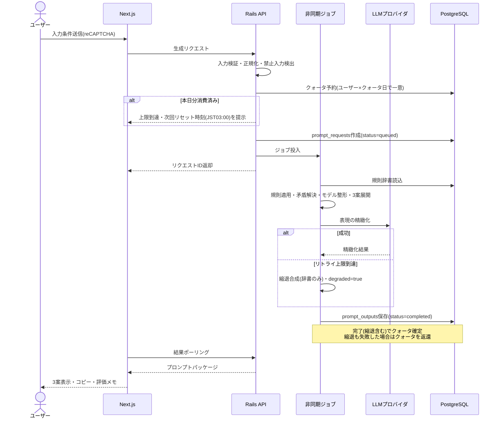
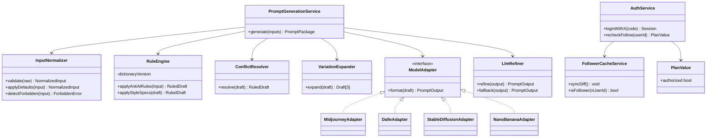
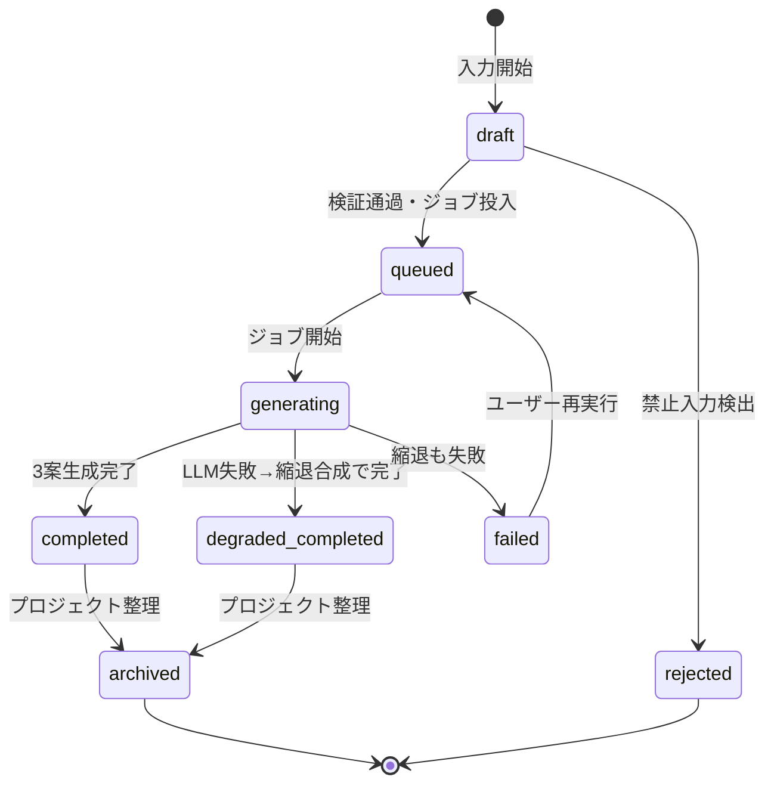
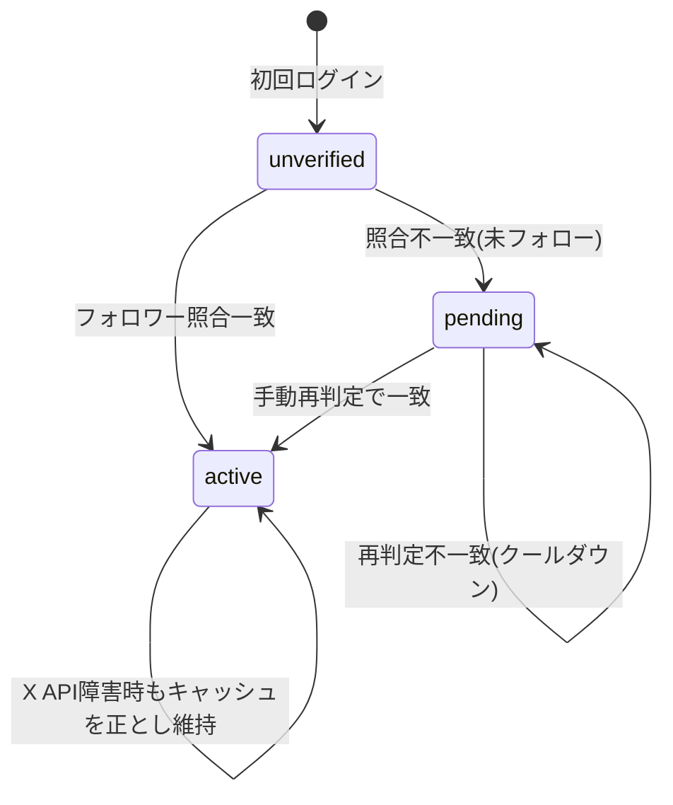
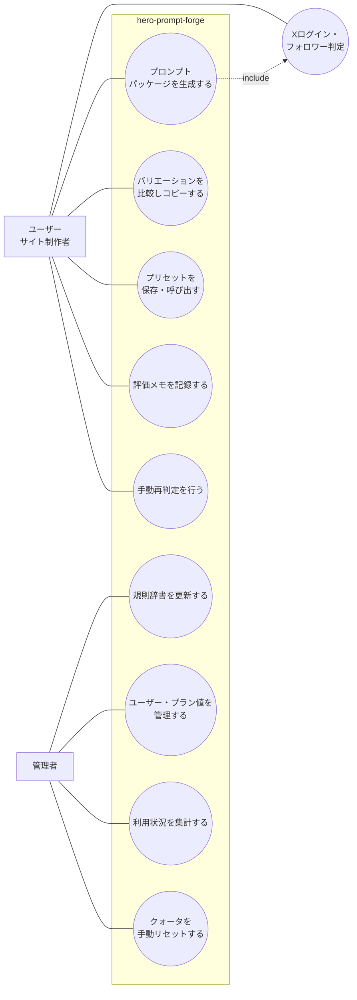

# hero-prompt-forge 仕様書（製品版フルエディション）

## 1. 概要

### 1.1 目的

ウェブサイトのヒーローイメージ（ファーストビューの主画像）を画像生成AIで制作する際の、プロ仕様のプロンプトを生成するウェブアプリケーションである。生成AIの出力にありがちな「AIっぽさ」（クリシェ的な配色・意味のないオブジェクト・破綻した人物表現）を設計段階で排除し、アートディレクターが指示するレベルの具体性を持つプロンプトを出力することで、ウェブサイトの第一印象を業務品質に引き上げる。

### 1.2 対象エディション

製品版フルエディション（納品用）。デザイン・測定・保守・監視の4軸をすべて実施する。

### 1.3 プラットフォームと選定理由

**ウェブ**を選択する。成果物であるプロンプトを直接読み・操作するのは人間（サイト制作者・デザイナー・マーケター）であり、ユーザーの入力に応じて出力が毎回変わる動的な処理と、生成履歴・プリセットの永続化を必要とするため、ウェブ・デスクトップ・スマホのいずれかが該当する。ブラウザ完結が最も導入障壁が低く、ローカル資源（GPU・ローカルLLM）を要求する理由がないため、ウェブとする。

### 1.4 リポジトリ名

`hero-prompt-forge`

## 2. 用語定義

| 用語 | 定義 |
|---|---|
| プロンプトパッケージ | メインプロンプト・ネガティブプロンプト・アートディレクションノート・バリエーション3案の一式 |
| アンチAIルック規則 | AI生成画像に典型的なクリシェ表現を排除するための規則群（禁止語彙とネガティブプロンプト対応表） |
| コピースペース | ヒーローイメージ上に見出し・CTAボタンを重ねるために確保する余白領域 |
| スタイル系統 | 実写（フォトリアル）／イラスト／3D／抽象の4分類 |
| モデルアダプタ | 生成モデルごとの記法（パラメータ・自然文・ネガティブ有無）に出力を整形する変換層 |
| プラン値 | ユーザーのアクセス権を表す単一項目。判定手段（フォロー判定等）から独立して保持する |

## 3. システム構成・技術スタック

| 層 | 技術 | 備考 |
|---|---|---|
| フロントエンド | Next.js（TypeScript） | 無料Vercelへデプロイ |
| バックエンドAPI | Ruby on Rails | 無料Railwayを優先、利用不可の場合のみRender |
| プロンプト精緻化 | LangChain（LangSmith / LangGraphを含む） | LLMによる表現の磨き込みに使用 |
| DB | PostgreSQL | |
| 管理画面 | Rails（同一バックエンド内） | BASIC認証 |
| Bot対策 | reCAPTCHA | 生成リクエストのフォームに適用 |
| 認証 | Xログイン（OAuth 2.0 + PKCE） | 指定アカウントのフォロワーであることを利用条件とする |

スケーラビリティ・高可用性のため、アプリケーションサーバーはステートレスに構成し、セッション状態はDBに置く。LLM呼び出しは非同期ジョブとしてキュー処理し、フロントはポーリングまたはサーバー送信イベントで結果を受け取る。

## 4. 機能要件

### 4.1 コア関数：ヒーローイメージプロンプト生成

本アプリの中核となる関数。以下の入力を受け取り、プロンプトパッケージを出力する。

**入力**

| 項目 | 必須 | 内容 |
|---|---|---|
| 業種 | ○ | 選択式（SaaS／飲食／医療／教育／不動産／製造／士業／EC／美容／その他） |
| スタイル系統 | ○ | 実写／イラスト／3D／抽象 |
| 生成モデル | ○ | Midjourney系／DALL-E系／Stable Diffusion系／nano banana系 |
| サービス概要 | − | 自由記述（日本語可） |
| ブランドトーン | − | 選択式（信頼感／先進性／温かみ／高級感／親しみ／ミニマル） |
| ブランドカラー | − | カラーコード（最大2色） |
| コピースペース位置 | − | 左／右／中央下（既定値：左） |
| アスペクト比 | − | 16:9／21:9／3:2（既定値：16:9） |

**処理ロジック（自然言語定義）**

1. **入力検証・正規化**：必須3項目の存在を検証する。任意項目の欠損は既定値で補完する（トーン未指定は業種ごとの標準トーンを適用する）。実在人物名・企業ロゴ・第三者著作物への言及を検出した場合は生成を行わず、理由を付してエラーを返す。
2. **アンチAIルック規則の適用**：規則辞書（マスタデータ）に基づき、AIクリシェに該当する表現の生成を抑止する語をメインプロンプトから排除し、対応するネガティブプロンプト（クリシェ配色・無意味な3Dオブジェクト・過剰な彩度・破綻した手指等）を注入する。
3. **プロ仕様具体化**：スタイル系統ごとの仕様化規則を適用する。実写系はレンズ焦点距離・照明設計（キーライト／フィルライト／リムライト）・被写界深度を明示する。人物を含む場合は顔・手指の破綻リスクを構図（後ろ姿・手元クロップ・遠景）で回避する。イラスト・3D系は線の質感・マテリアル・レンダリング様式を明示する。
4. **コピースペースの構図規定**：指定位置に基づき三分割構図と余白量を規定し、被写体・視線誘導が余白側と競合しない配置を指示する。
5. **矛盾解決**：入力間で規則が衝突する場合、優先順位「①コピースペース確保 ＞ ②ブランドカラー ＞ ③スタイル系統 ＞ ④トーン装飾」に従い、下位の指定を「示唆」レベルに弱めて統合する。ブランドカラーは画面全体の支配色ではなくアクセントとして自然に統合する。
6. **固有名詞の保持**：日本語固有名詞は翻訳せずローマ字表記で保持し、意味説明を併記する。
7. **モデル別整形**：モデルアダプタが、選択モデルの記法（パラメータ付与・自然文化・ネガティブプロンプトの分離）に出力を変換する。
8. **バリエーション生成**：構図の異なる3案（被写体主導／環境主導／抽象背景）を出力する。
9. **アートディレクションノートの付与**：各案に、生成後に人間が確認すべき観点（コピースペースの実際の可読性・ブランドカラーの再現度・クリシェ混入の有無）を記載したノートを添付する。

**出力**

プロンプトパッケージ（3案 × {メインプロンプト、ネガティブプロンプト（対応モデルのみ）、推奨パラメータ、アートディレクションノート}）。

### 4.2 設計原則（アンチAIルック）

以下を機能横断の設計原則として定める。

- クリシェ配色（紫〜ティールのグラデーション等）・意味を持たない浮遊オブジェクト・過剰な彩度とボケは、規則辞書により常時排除する。
- 実写系プロンプトには撮影指示（レンズ・照明・被写界深度）を必ず含める。撮影指示を欠くプロンプトは出力しない。
- 人物の顔を正面から大きく描写する構図は既定で回避し、ユーザーが明示的に指定した場合のみ許可する。
- すべての案にコピースペースの指定を含める。コピースペースを持たないヒーローイメージ用プロンプトは出力しない。
- 矛盾する入力を受けた場合も出力を停止せず、優先順位規則により統合した案を返す。ただし統合内容をアートディレクションノートに明記する。

### 4.3 付随機能

| 機能 | 内容 |
|---|---|
| プロジェクト管理 | サイト単位で入力条件を保存し、再生成・条件変更に用いる |
| プリセット | 入力条件の組み合わせを名前付きで保存・呼び出しする |
| 生成履歴 | プロンプトパッケージの履歴を保持し、過去案の再表示・複製を行う |
| プロンプト評価メモ | 生成画像を実際に作った結果の所感をユーザーが記録し、次回条件調整の参考とする |
| 管理画面 | 規則辞書（アンチAIルック規則・スタイル仕様化規則・業種既定値）の追加・編集、ユーザー・プラン値の管理、手動再判定、クォータの手動リセット |

### 4.4 利用回数制限（1アカウント1日1回）

プロンプト生成は1アカウントにつき1日1回とする。以下を要件とする。

- **クォータ日の境界**：リセット時刻はJST 03:00とし、03:00を境界とする「クォータ日」で消費を管理する。消費の帰属は**ジョブ投入（予約）時点**のクォータ日とし、生成完了がリセット時刻を跨いでも帰属は変わらない。
- **消費タイミング**：入力検証を通過しジョブ投入する時点で、クォータを**予約消費**する。（ユーザー × クォータ日）の一意制約により、二重送信・並列投入で同日2回以上通らないことをDBレベルで担保する。
- **消費の確定と返還**：
  - `completed`（通常完了）および `degraded_completed`（縮退完了）は、成果物を提供しているため消費を確定する。
  - `failed`（縮退も失敗）はクォータを返還し、当日中の再生成を可能とする。
  - `rejected`（禁止入力）はジョブ投入前に確定するため、クォータを消費しない。
  - `failed` からの再実行は同一リクエストの再実行として扱い、追加消費しない。
- **上限到達時の応答**：上限到達を明示し、次回リセット時刻（JST 03:00）を必ず提示する。曖昧なエラーを返さない。
- **手動リセット**：開発者（管理者）は管理画面から任意のユーザーの当日消費をリセットできる。リセットは実施者・日時とともに記録する。
- クォータはプラン値と独立した仕組みとし、将来のプラン拡張（回数の異なるプランの追加）時にクォータ上限をプラン値から導出できる構造とする。

## 5. 非機能要件

### 5.1 スケーラビリティ・可用性

- アプリケーションサーバーはステートレスとし、水平スケール可能な構成とする。
- LLM呼び出しは非同期ジョブとし、ジョブ失敗時はリトライ上限付きで再実行する。上限到達時は失敗として履歴に記録し、ユーザーへ再実行導線を提示する。
- LLMプロバイダの障害時は、規則辞書のみによるテンプレート合成（LLM精緻化なし）へ縮退して稼働を継続する。縮退で生成された案にはその旨を明記する。

### 5.2 セキュリティ

- 認証はXログイン（OAuth 2.0 + PKCE）とする。
- 開発者用管理画面はBASIC認証とする。
- 生成リクエストのフォームにreCAPTCHAを適用する。
- APIキー・照合先アカウントID等の秘匿値はすべて環境変数で外部化する。
- LLMへ送信する入力はユーザーの入力条件のみとし、認証情報・個人識別子を含めない。

### 5.3 個人情報

プライバシーポリシー・個人情報管理規程に従い設計する。保持する個人関連情報はXのユーザーID（識別子）と表示名のみとし、メールアドレス・住所・電話番号は取得しない。

## 6. 認証・アクセス制御

- 指定Xアカウントのフォロワーであることを利用条件とする。
- フォロワーIDリストをサーバー側にキャッシュし、認証で取得したユーザーIDと照合して判定する。初回のみ全件取得し、以降は差分取得とする（ログインのたびにX APIを呼び出さない）。
- 照合先アカウントIDは環境変数で外部化する。
- 判定結果は**プラン値**（単一項目）としてユーザーに保持し、機能側はプラン値のみを参照する。フォロー判定の有無から機能側が直接判定しない。判定手段を変更・廃止しても機能側の実装に影響を与えないことを設計上の要件とする。
- フォロー直後の判定漏れに対して、ユーザー操作による手動再判定の導線を設ける。再判定にはクールダウン（レート制限保護）を必須とする。
- X APIの障害時はキャッシュを正とし、新規判定のみ停止する。既存ユーザーを締め出さない。

## 7. 運用要件（測定・保守・監視）

### 7.1 測定（測定軸のみを定義する）

- 生成リクエスト数（ユーザー別・業種別・スタイル別・モデル別）
- バリエーション3案のうちコピーされた案の分布（構図タイプ別の採用傾向）
- プロンプト評価メモの記録率と評価傾向
- 再生成率（同一プロジェクトでの条件変更回数）
- 縮退モードでの生成比率
- 上限到達の発生数（クォータ到達により生成できなかったアクセス数。追加需要の観測に用いる）
- クォータ返還の発生数（生成失敗の間接指標）
- 稼働率

### 7.2 保守

- 生成モデル各社の仕様変更（パラメータ記法・ネガティブプロンプト対応の変更）に追随し、モデルアダプタと規則辞書を改訂する。
- 規則辞書は管理画面から無停止で更新可能とし、辞書のバージョンを生成履歴に記録する。
- 不具合対応・機能改修のリリースフローを定義し、DBマイグレーションは後方互換を保って段階適用する。

### 7.3 監視

- ヘルスチェック用エンドポイントを設け、DB到達性を含めて応答する。
- 死活監視は外形監視サービス（無料枠のあるもの）またはデプロイ先の標準機能で行い、監視スタックを別途構築しない。
- 通知先を定義し、通知が復旧行動に繋がる体制（担当・一次対応手順）を運用文書に明記する。
- LLMジョブの失敗率・縮退モード発生をアラート対象とする。
- X APIのエラー率を監視し、フォロワーキャッシュの差分取得失敗を検知する。

## 8. ER図

## 9. DFD

### 9.1 レベル0（コンテキスト図）

### 9.2 レベル1

## 10. シーケンス図

### 10.1 ログインとフォロワー判定

### 10.2 プロンプト生成

## 11. クラス図

## 12. 状態遷移図

### 12.1 プロンプトリクエストの状態

**クォータとの対応**：`queued` への遷移時に予約消費し、`completed`／`degraded_completed` で確定、`failed` で返還する。`rejected` は消費しない。`failed → queued` の再実行は同一リクエストの再実行であり、追加消費しない。

### 12.2 ユーザーのアクセス権（プラン値）の状態

## 13. ユースケース図

